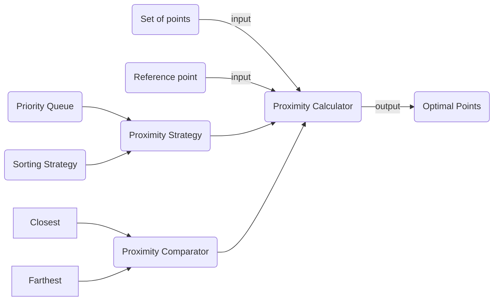
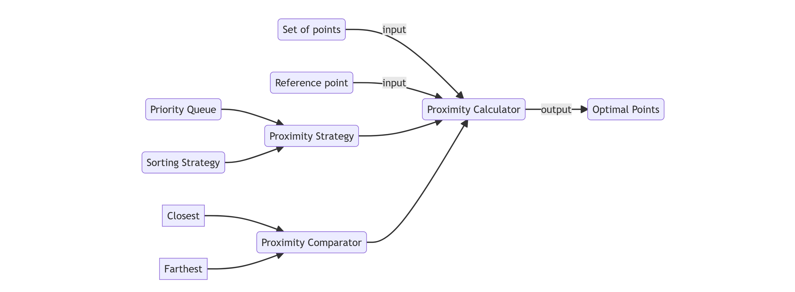

# Introduction
- Input: set of points and reference point
- Output: determines the optimal set of points according to predefined metrics (i.e., closest, farthest to the reference point)


# Architecture






# Solution
### Technologies
- Spring
- Gradle
- Lombok

### Package Structure
- `comparator`: logic for comparing points relating to a reference point; abstract different comparing possibilities
- `configuration`: bean creation
- `models`: model objects
- `proximity.calculator.strategies`: logic for different proximity calculator possibilities (e.g., Priority Queues, Sorting, etc.); abstracts different strategies
- `readers`: logic for reading the points from different sources~~~~; abstracts reading sources
  - Provides support for reading the input in a lazy fashion through iterators
- `writers`: logic for printing the results; abstract writing sources

### Conceptual Approach
- Read the points and the reference point.
- Compare the set of points to the reference.
- Determine the optimal set of points.

The optimal set of points can be determine using different approaches. Current implementations:
- Priority Queue Strategy
- Sorting Stragegy

### Priority Queue Strategy
- Initializes a Priority Queue (Heap) using the required comparator
- Sets its size to the maximum number of points required to determine
- Reads the input points one by one and adds them to the Heap
- The heap does not grow over the maximum number of points
- Complexity
  - Assuming n is number of points and m number of max points to determine
  - Time: O(n log m), practically O(n) when the max points to determine is small 
  - Memory: O(m), practically O(1) for small number of points

### Sorting
- Reads the input points one by one and adds them to an Array
- Sort the array
- Complexity
    - Assumin n: number of points
    - Time: O(n log n)
    - Memory: O(n)

    
# Testing
- Parameterized tests for each test cases and for each strategy

### CMD
You might need to make gradlew or gradlew.bat executable.

```groovy
./gradlew clean test

```

### IDE
Import project in your IDE and run them from the IDE.

# Prerequisites
- Java 11 or a newer version is available on your system

# Running the application

### Params
- `points.path` The set of points. Initialize with the path to the file that contains the points. Escape the path if required.
- `reference.point.x`: the x coordinate for the reference point
- `reference.point.y`: the y coordinate for the reference point
- `max.points`: the number of points to determine that are closest or farthest from the reference point
- There will be multiple `spring.profiles.active` properties:
    - **Proximity Comparator**: initialize `spring.profiles.active` with one of `[proximity.farthest, proximity.closest]`
    - **Proximity Calculator Strategy**: initialize `spring.profiles.active` with one of `[proximity.strategy.priority.queue, proximity.strategy.sorting]`
    - **Input Source**: initialize `spring.profiles.active` with one of `[binary.reader, json.reader]`
    - **Output Source**: initialize `spring.profiles.active` with one of `[command.line.writer]`

### CMD
You might need to make gradlew or gradlew.bat executable.

```groovy
./gradlew -q bootRun -Pargs=--points.path=<path-to-file>,--reference.point.x=0,--reference.point.y=0,--max.points=5,--spring.profiles.active=proximity.closest,--spring.profiles.active=proximity.strategy.priority.queue,--spring.profiles.active=binary.reader,--spring.profiles.active=command.line.writer

```

You can pipe the execution to a file, if you want to store the results for later analysis.

### Notes
- This should also work under Windows using Git Bash. Otherwise, use the `gradlew.bat` version for pure Windows systems.
- If you also want to see the running time, add `time` before the previous command, if available on your system.

### Errors
- Please consult the contents of the `application.log` file if problems arise. This can be found in the root directory where you execute the application.

# Future directions
- Improved exception handling
- Add support to expose the functionality through and API to be accessed programatically
- Create a Graphical User Interface to interact with the application
- Add more **Input Sources**
  - HTTP APIs
  - Databases
  - etc.
- Add more **Output Sources**
  - File (this can also be emulated using pipes in Linux environments)
  - etc.
- Measure performance using AOP
- Containerize application
